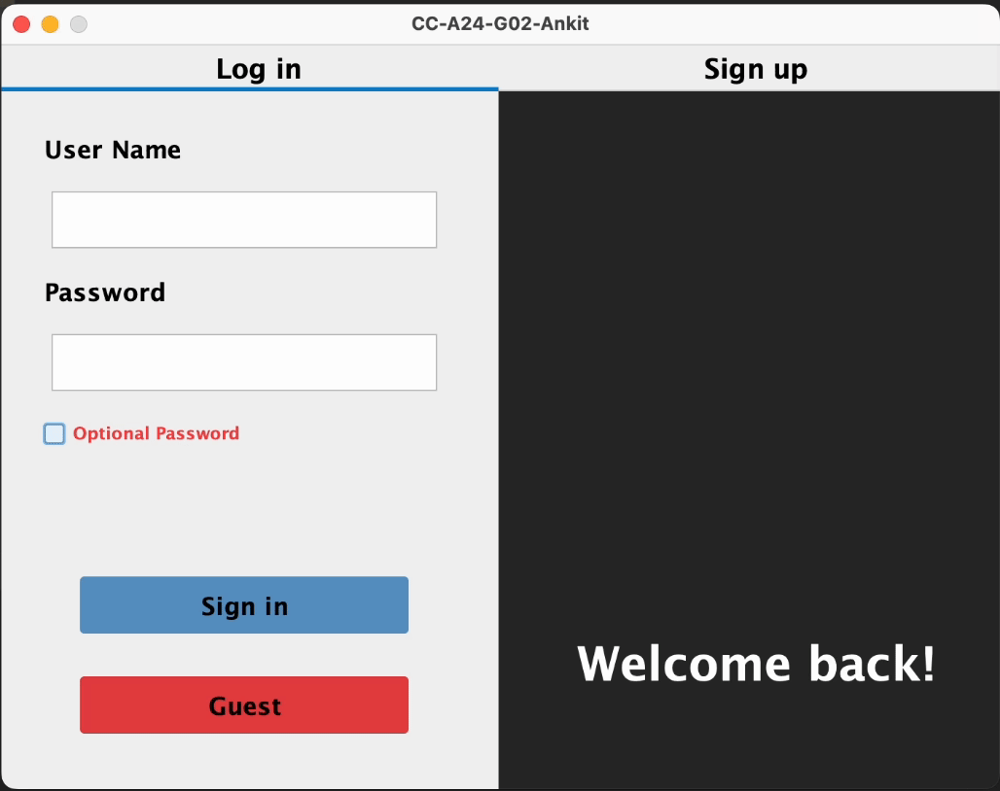
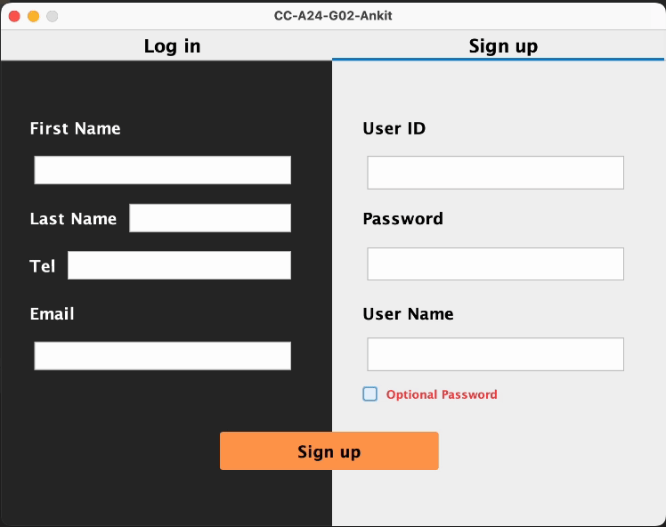
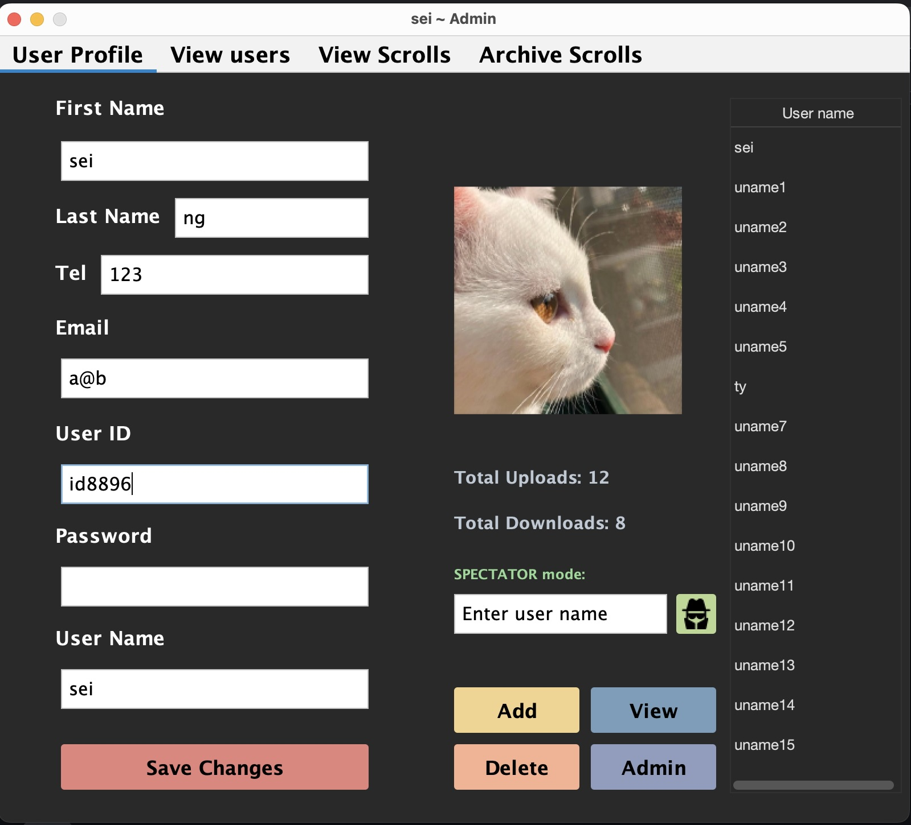
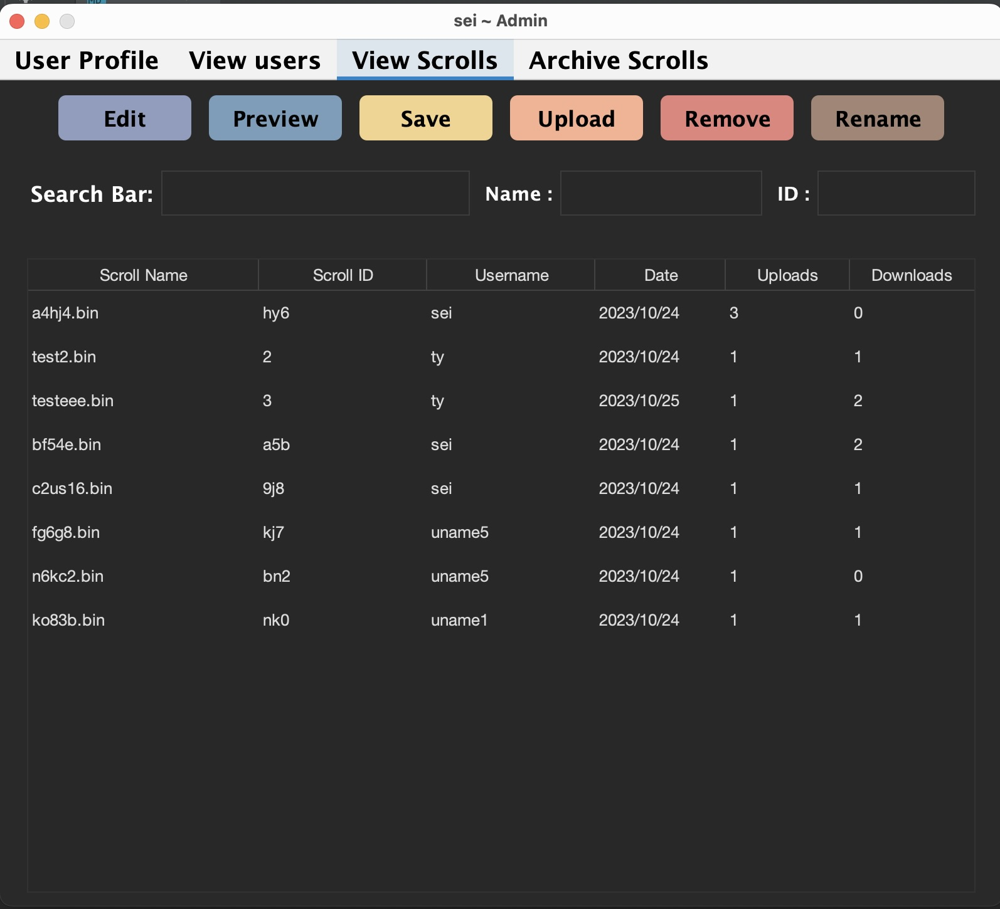

# Scroll Editor

## Table of Contents
**[Overview](#Overview)**<br>
**[Dependencies](#Dependencies)**<br>
**[Features](#Features)**<br>
**[Execute](#Execute)**<br>
**[Testing](#Testing)**<br>
**[References](#References)**<br>

## Overview
In this project, we are aiming to design a software product by using Scrum methodology and Agile development practice from design and develop the Virtual Scroll Access System (VSAS), a digital repository to grant Whiskers access to the library's knowledge, represented as downloadable binary files. This system will serve as a portal to the realm of digital wisdom, where library staff and members can efficiently access, download and upload these files.
<br/>

## Getting Started

### Important Notes:
* **Application**
    * `Log in` if existing users ; `Sign up` if new user ; `Guest` can only preview scroll. 
    * `Sign up`: `Email` must contain `@`. `Tel` must be an `int`.
    * `Scroll` must be a `.bin` file. 

### Dependencies

* Java SE Development Kit (JDK) 17

### Features

* **User Management**
    * **Registration and Login**: Each account are identified with a unique `username` and `userid`
    * **Update User Profiles**: Users are able to change any information in their profile, including avatar.
    * **Guest Users**
    * **Admin Users**: have special admin privileges:
      1. Have all rights of a user 
      2. Give admin rights to users
      3. Signup new user account
      4. Remove users' account
      5. View all users profile
      6. Spectate users without password when necessary
      7. View upload and download scroll stats
      8. Archive scroll
    * **User Type Display**: display current user privilege on app title, [username] ~ [privilege]: `Admin`, `User`, `Guest`
    * **Password encryption**: The password for login stored are encrypted, and won't be shown as plain text even in user profile.
    
* **Digital Scroll Management**
    * **Add and Remove Digital Scrolls**
    * **Edit and Update Digital Scrolls**

* **Scroll Seeker**
    * **View Scrolls**
    * **Preview and Download Scrolls**
    * **Search Filters**
    
* **Extra user requirements**
    * **Add `2 minutes Timer` to `Preview`**
    * **Make an `Archive` button for `Admin`**
    * **`Spectator` mode for `Admin`**
    * **`Optional password` for all accounts when sign up**
    
<br/>


### Execute
Clone the repo, `cd` to `java-scroll-editor` 
```
gradle clean build run
```

<strong>Login</strong>
* User that has an `optional password`, must sign in using both passwords

<p align='center'>
   
</p>

<strong>Sign up</strong>
* `Email` must contain `@`
* `Tel` must be an `int`
* User can choose to have `Optional Password` (cant be changed) by ticking the box
* This will create a `User` account by default
* Here's an `Admin` account that you can use
* From this `Admin` account, you can switch to any accounts with `Spectator mode`

```
username: ankit
password: pwd
```

<p align='center'>
  
</p>

<strong>User Profile</strong>
* `Guests` don't have a user profile
* `Users` only have `Save changes` and `profile picture` which can be changed by clicking the image.  
* This is an `Admin` profile with full rights
* Changing information is restricted same as sign up, `Email` must have `@`, `Tel` is `int` and unique `username` and `userid`
<p align='center'>
  
</p>

* `Spectator`: allow to enter spectator mode of as another user using username
* `View`: redirect to `View users` tab
* `Admin`: make any user under user table an admin
* `Add`: sign up new user account
* `Delete`: remove any account under user table
* `Save changes`: save any changes in personal informations

<strong>View Scrolls</strong>
* View all available scrolls
* Only scroll owner can `edit`, `delete`, `rename` scroll
* `Edit`: if not scroll owner, open as `preview` mode, else, can only input `0`, `1`
* `Preview`: close after 2 mins timer
* `Save`: downloaded chosen scrolls to the directory the user choose, in `scroll` directory.
* `Upload`: only `.bin` file accepted
* `Remove`: delete chosen scroll
* `Search Bar`: filter scrolls with matching info in any column
* `Name`: field to rename a scroll
* `ID`: field to change a scroll id 
<p align='center'>
  
</p>

<strong>Archive Scrolls</strong>
* Only `Admin` can `archive scrolls`
* Delete all current scrolls
* Store deleted scrolls in `Archive` folder under `resources`

### Testing
To run the test
```
gradle test
```
To generate JaCoCo test report
```
gradle test jacocoTestReport
```

<br/>

## References

* create local directory
https://stackoverflow.com/questions/3634853/how-to-create-a-directory-in-java
* detete file
https://www.javatpoint.com/how-to-delete-a-file-in-java#:~:text=In%20Java%2C%20we%20can%20delete,must%20be%20empty%20to%20delete.
* Current date 
https://stackoverflow.com/questions/5175728/how-to-get-the-current-date-time-in-java
* Time format
https://stackoverflow.com/questions/6118922/convert-seconds-value-to-hours-minutes-seconds#:~:text=hours%20%3D%20totalSecs%20%2F%203600%3B%20minutes,)%20in%20the%20string%2C%20though.
* Timer count down
https://stackoverflow.com/questions/26965049/java-gui-countdown
* Resize icon in button
https://stackoverflow.com/questions/2856480/resizing-a-imageicon-in-a-jbutton
* Spy icon
https://www.flaticon.com/free-icon/spy_312371
* Add icon in jbutton
https://www.tutorialspoint.com/how-to-add-icon-to-jbutton-in-java
* choose .bin file only
https://stackoverflow.com/questions/22873417/choosing-a-txt-file-with-jfilechooser-and-making-it-appear-on-a-jtextfield-just
* timer
https://stackoverflow.com/questions/62539867/how-to-make-a-jframe-close-itself-after-10-seconds
* show details from start jfile chooser
https://stackoverflow.com/questions/16292502/how-can-i-start-the-jfilechooser-in-the-details-view
* download file with file chooser
https://stackoverflow.com/questions/33029792/jfilechooser-and-copying-files
* Jtable
https://stackoverflow.com/questions/3549206/how-to-add-row-in-jtable
https://stackoverflow.com/questions/3179136/jtable-how-to-refresh-table-model-after-insert-delete-or-update-the-data
https://stackoverflow.com/questions/72838796/how-to-individually-set-the-width-of-a-row-on-a-table-scrollpane
https://stackoverflow.com/questions/17627431/auto-resizing-the-jtable-column-widths
https://stackoverflow.com/questions/9919230/disable-user-edit-in-jtable
https://stackoverflow.com/questions/1990817/how-to-make-a-jtable-non-editable
* detect arrow key
https://stackoverflow.com/questions/4522090/how-can-i-detect-arrow-keys-in-java
* set cursor position in jtextfield
https://stackoverflow.com/questions/31322783/how-to-move-the-cursor-position-in-a-jtextfield
* keyevent in general
https://docs.oracle.com/javase%2F7%2Fdocs%2Fapi%2F%2F/java/awt/event/KeyEvent.html
* rename jfilechooser
https://stackoverflow.com/questions/29347965/rename-file-directory-using-jfilechooser-and-jbutton
* Jenkins
https://www.youtube.com/watch?v=WsqKMzmms8w&t=1829s
https://www.youtube.com/watch?v=fCnmcsc7VEc
* Window listener
https://www.tabnine.com/code/java/methods/java.awt.Window/addWindowListener
https://docs.oracle.com/javase/8/docs/api/java/awt/event/WindowListener.html
* Login, Java Swing Syntax
https://www.youtube.com/playlist?list=PLyVKCvpm4iiS-NZ0z349Sg-muhayUK-p_
* Divide windows to tabs
https://stackoverflow.com/questions/8752037/how-to-change-background-color-of-jtabbedpane/8752166#8752166
* Scrolled pane
https://stackoverflow.com/questions/21636895/how-to-add-a-scroll-bar-to-a-jtabbedpane-basically-i-have-an-admin-panel-which
* Close jframe from sub jpanel
https://stackoverflow.com/questions/17829098/how-to-close-specific-jframe-based-on-events-on-jpanel-without-exiting-applicati
https://stackoverflow.com/questions/33192921/why-is-java-gui-jframe-size-different-sizes-on-different-operating-systems?utm_medium=organic&amp;utm_source=google_rich_qa&amp;utm_campaign=google_rich_qa
https://stackoverflow.com/questions/7799940/jframe-exit-on-close-java
* Change button color on mac
https://stackoverflow.com/questions/1065691/how-to-set-the-background-color-of-a-jbutton-on-the-mac-os#:~:text=Normally%20with%20Java%20Swing%20you,setBackground(Color.
* Change row height (not JTable)
https://stackoverflow.com/questions/7229226/should-i-avoid-the-use-of-setpreferredmaximumminimum-size-methods-in-java-sw
* Set up feel and look
https://www.youtube.com/watch?v=ItvySaAeKTU
* Use feel and look
https://search.maven.org/artifact/com.formdev/flatlaf/3.2.1/jar?eh=
https://www.tutorialspoint.com/how-to-set-a-different-look-and-feels-to-swing-components-in-java
https://opensource.com/article/22/3/beautify-java-applications
https://www.formdev.com/flatlaf/customizing/
* Convert mov to gif
https://new.express.adobe.com/tools/convert-to-gif
* Archive feature
https://docs.oracle.com/javase/8/docs/api/java/nio/file/Files.html
https://docs.oracle.com/javase/tutorial/essential/io/

<br/>
